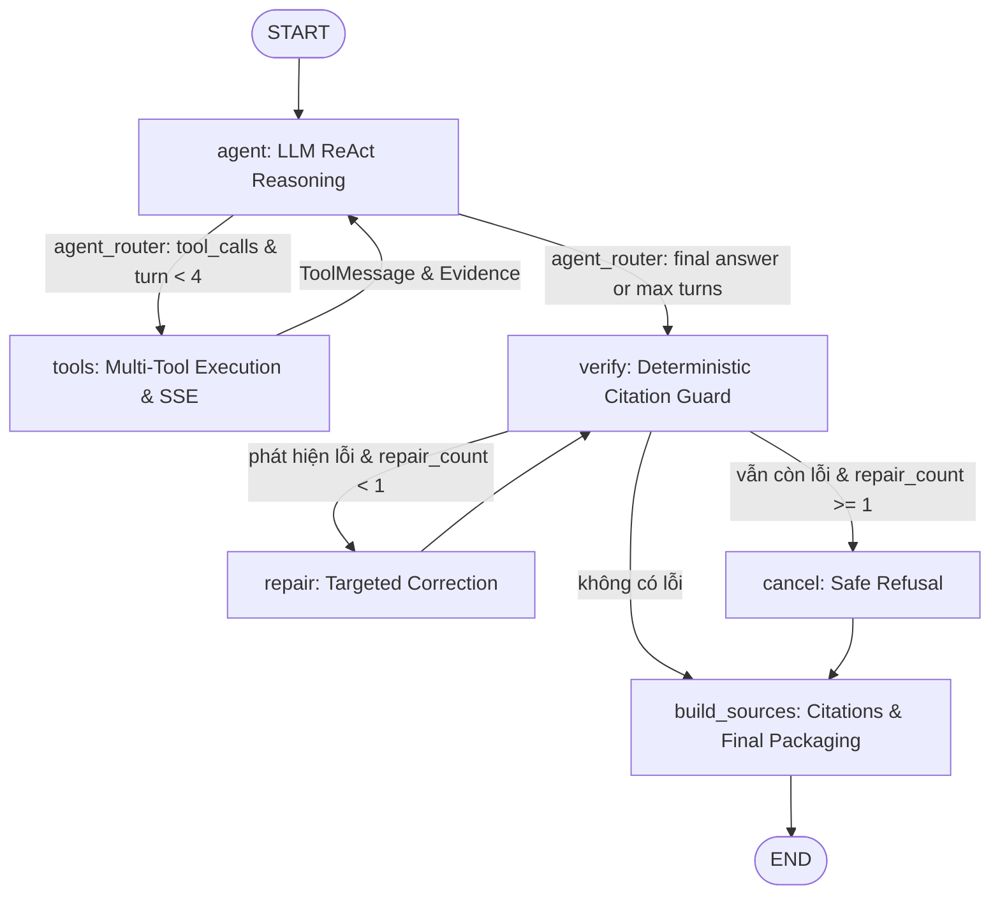

# Kiến trúc LexTraffic AI — Agentic ReAct StateGraph

Tài liệu này mô tả kiến trúc điều phối hiện tại của LexTraffic AI: **Agentic ReAct StateGraph** xây dựng trên nền tảng LangGraph 1.x, thay thế cho mô hình pipeline thác nước (waterfall) cứng nhắc trước đây.

Hệ thống cho phép mô hình ngôn ngữ lớn (LLM) chủ động suy luận, lựa chọn công cụ tra cứu động qua nhiều lượt (multi-turn reasoning), đồng thời được bao bọc bởi lớp kiểm chứng pháp lý tất định (deterministic verification guardrails) để triệt tiêu hiện tượng bịa đặt số liệu hoặc sai lệch trích dẫn.

---

## 1. Triết lý kiến trúc: Agentic ReAct kết hợp Lớp Kiểm Chứng Tất Định

### 1.1 Vấn đề của mô hình cũ (Waterfall Pipeline)
Trong kiến trúc cũ, luồng xử lý bị cố định theo dạng tuyến tính:
`START -> normalize -> memory -> route -> fanout -> rerank -> compact -> synthesize -> verify -> repair -> END`.
Mô hình này bộc lộ các nhược điểm chí tử:
1. **Router LLM bóp méo câu hỏi**: Một model nhỏ đóng vai trò router thường diễn giải sai hoặc thu hẹp từ khóa (ví dụ câu hỏi *"Ai lái được hạng xe DE"* bị router viết lại thành *"quy định về xe máy hạng D, xe ô tô hạng D"* làm công cụ tìm kiếm bỏ sót hoàn toàn hạng DE).
2. **Compact làm mất thông tin pháp lý**: Hàm cắt ngắn ngữ cảnh (compact) giới hạn tài liệu ở 250 ký tự khiến các điểm, khoản ở cuối điều luật (như điểm p Khoản 1 Điều 57 về Hạng DE) bị cắt bỏ.
3. **Mô hình bị tước đoạt công cụ**: Node `synthesize` không được bind công cụ (`bind_tools([])`), chỉ được đọc kết quả một lần thụ động và hoàn toàn bất lực nếu lần truy xuất ban đầu thiếu dữ kiện.
4. **Độ trễ tích lũy**: Trải qua 14 node trung gian và nhiều lần gọi LLM nối tiếp khiến thời gian phản hồi kéo dài lên tới hàng trăm giây.

### 1.2 Giải pháp kiến trúc mới: Agentic ReAct Loop
1. **Agent tự chủ suy luận & chọn công cụ**: LLM nhận trực tiếp câu hỏi người dùng cùng toàn bộ schema công cụ chuyên biệt (`TrafficLawTools`). Mô hình tự quyết định gọi công cụ nào (`keyword_search`, `get_article`, `penalty_lookup`, `traffic_sign_lookup`, `speed_limit_lookup`), xem xét bằng chứng trả về và quyết định tra cứu tiếp hay tổng hợp câu trả lời.
2. **Tra cứu động nhiều lượt (Multi-turn ReAct)**: Tối đa 4 vòng lặp (`MAX_TURNS = 4`). Nếu kết quả tìm kiếm sơ bộ chỉ ra Điều 57, Agent có thể gọi tiếp `get_article(57)` để đọc nguyên văn điều luật đầy đủ.
3. **Lớp kiểm chứng tất định độc lập**: Sau khi Agent hoàn thành câu trả lời, node `verify` đối chiếu số liệu tiền phạt, thời gian tước GPLX, và số Điều/Khoản với dữ liệu gốc (`raw_tool_output`). Nếu có lỗi sai, hệ thống cho phép sửa 1 lần (`repair`), nếu vẫn không đạt sẽ kích hoạt `cancel` để từ chối an toàn thay vì cung cấp thông tin sai lệch.

---

## 2. Sơ đồ StateGraph

Khớp chính xác với `create_legal_graph()` trong `src/graph/build.py`:



### Chi tiết luồng điều phối:
- **Đường tắt ngoài đồ thị (Semantic Cache)**: Trước khi kích hoạt StateGraph, `src/graph/turn.py::run_turn()` kiểm tra Semantic Cache trong SQLite. Nếu câu hỏi trùng khớp ngữ nghĩa (độ tương đồng cosine $\ge 0.97$), hệ thống phát ngay câu trả lời đã qua kiểm chứng trước đó qua SSE mà không tốn chi phí gọi LLM.
- **Node `agent` (`src/graph/agent_node.py`)**: Gọi mô hình LLM chính (`LLM_MODEL`) với các công cụ tra cứu được bind qua cơ chế Function Calling chuẩn. LLM stream các token trực tiếp tới người dùng hoặc sinh `tool_calls`.
- **Node `tools` (`src/graph/retrieve.py`)**: Thực thi song song hoặc tuần tự các tool calls do Agent yêu cầu, thu thập bằng chứng `Evidence`, cập nhật `agent_steps` cho giao diện UI, và phát các sự kiện SSE `tool_call` & `tool_result`.
- **Node `verify` (`src/graph/verify.py`)**: Đối chiếu câu trả lời với `raw_tool_output` nguyên bản.
- **Node `repair` (`src/graph/repair.py`)**: Nhắc nhở mô hình sửa đúng các điểm sai lệch về số liệu hoặc căn cứ pháp luật. Bị giới hạn cứng ở tối đa 1 lượt.
- **Node `cancel` (`src/graph/verify.py`)**: Thay thế câu trả lời sai bằng phản hồi từ chối an toàn (Safe Fallback).
- **Node `build_sources` (`src/graph/verify.py`)**: Định dạng danh sách nguồn trích dẫn pháp lý hiển thị trên giao diện người dùng.

---

## 3. Trạng thái Đồ thị (LegalAgentState)

Định nghĩa tại `src/graph/state.py`:

| Trường | Kiểu dữ liệu | Reducer | Mục đích |
|---|---|---|---|
| `messages` | `List[AnyMessage]` | `add_messages` | Danh sách tin nhắn trao đổi (HumanMessage, AIMessage, ToolMessage). Được quản lý bởi LangGraph Checkpointer. |
| `turn_count` | `int` | ghi đè | Số lượt ReAct hiện tại của Agent trong một phiên truy vấn (tối đa 4). |
| `evidence` | `List[Evidence]` | `operator.add` | Danh sách bằng chứng pháp lý thu thập được từ các công cụ tra cứu. |
| `agent_steps` | `List[Dict]` | `operator.add` | Vết thực thi của các công cụ, phục vụ vẽ timeline trên giao diện Web UI. |
| `packed_context` | `str` | ghi đè | Ngữ cảnh bằng chứng tổng hợp (dùng khi chạy sửa lỗi hoặc đối chiếu phụ). |
| `issues` | `List[str]` | ghi đè | Danh sách lỗi vi phạm phát hiện bởi node kiểm chứng `verify`. |
| `repair_count` | `int` | ghi đè | Số lần đã chạy qua node `repair` (chặn cứng tối đa 1 lần). |
| `sources` | `List[Dict]` | ghi đè | Danh mục văn bản, điều khoản trích dẫn định dạng sẵn cho UI. |

---

## 4. Kho Công Cụ Tra Cứu Pháp Luật (TrafficLawTools)

Tọa lạc tại `src/tools/law_search_tools.py`, các công cụ này được thiết kế theo đúng chuẩn JSON Schema cho Agent Function Calling:

### 4.1 `keyword_search(query: str, doc_scope: str = "all")`
- **Chức năng**: Tra cứu nhanh các điều khoản trong 6 văn bản pháp luật giao thông bằng phương pháp tìm kiếm lai (BM25 + Dense Vector + RRF).
- **Điểm ưu việt mới**: 
  - Cơ chế nhận diện cụm từ định danh đặc thù ("hạng DE", "đèn đỏ", "nồng độ cồn").
  - Trích xuất thông minh ưu tiên dòng chứa chính xác từ khóa thay vì cắt ngang ở đầu điều luật.
  - Tự động bỏ qua các stopword chung chung ("hạng", "xe", "quy định") khi xếp hạng snippet.

### 4.2 `get_article(article_number: int, law_id: str = "01_luat_36_2024_qh15")`
- **Chức năng**: Lấy toàn văn toàn bộ một Điều luật cụ thể mà không qua bất kỳ khâu rút gọn hay tóm tắt nào.
- **Vai trò trong ReAct**: Cho phép Agent khi phát hiện nghi vấn (ví dụ tìm thấy Điều 57 liên quan đến phân hạng bằng lái) có thể chủ động gọi `get_article(57)` để đọc trọn vẹn tất cả các điểm a tới p và phân tích chi tiết.

### 4.3 `penalty_lookup(violation_keyword: str, vehicle_type: str = "all")`
- **Chức năng**: Tra cứu 634 hành vi vi phạm và mức phạt tiền, hình thức phạt bổ sung, trừ điểm GPLX quy định tại Nghị định 168/2024/NĐ-CP.

### 4.4 `traffic_sign_lookup(sign_code: str)`
- **Chức năng**: Tra cứu mã hiệu, tên gọi, quy chuẩn và hình ảnh minh họa của 453 biển báo giao thông và vạch kẻ đường theo QCVN 41:2019/BGTVT.

### 4.5 `speed_limit_lookup(road_type: str, vehicle_type: str)`
- **Chức năng**: Tra cứu ma trận tốc độ tối đa cho phép và khoảng cách an toàn tối thiểu theo Thông tư 31/2019/TT-BGTVT.

---

## 5. Lớp Kiểm Chứng Tất Định (Verification Guardrails)

Nằm tại `src/graph/verify.py` và `src/answer_guard.py`:

1. **Kiểm tra số liệu phạt (`find_ungrounded_figures`)**:
   - Quét câu trả lời tìm các mức tiền phạt (ví dụ: "4.000.000 - 6.000.000 đồng"), số tháng tước bằng lái, số điểm GPLX.
   - So khớp trực tiếp với `raw_tool_output` nguyên văn nhận được từ Nghị định 168/2024. Nếu Agent tự ý bịa số liệu không có trong văn bản, câu trả lời sẽ bị chặn ngay.
2. **Kiểm tra căn cứ pháp lý (`find_invalid_citations`)**:
   - Đảm bảo Điều luật được viện dẫn phải thực sự tồn tại và đã được tra cứu trong phiên làm việc.
   - Chặn hiện tượng gán mức phạt tiền cho Luật (Luật Giao thông đường bộ chỉ quy định nguyên tắc và hành vi bị nghiêm cấm; thẩm quyền quy định tiền phạt thuộc về Nghị định).

---

## 6. Hợp Đồng Sự Kiện SSE (Server-Sent Events)

Giao tiếp thời gian thực giữa backend và frontend (`static/js/agent-trace.js`, `static/js/chat.js`) thông qua 14 sự kiện SSE chuẩn:

| Sự kiện SSE | Nguồn phát | Mục đích hiển thị trên Web UI |
|---|---|---|
| `start` | `agent_node` | Khởi tạo phiên làm việc mới |
| `turn_start` | `agent_node` / `repair_node` | Bắt đầu một vòng suy luận ReAct (`turn=1..4`) |
| `tool_call` | `tools_node` | Hiển thị thẻ công cụ Agent đang gọi (tên tool, tham số) |
| `tool_result` | `tools_node` | Hiển thị kết quả tóm tắt từ công cụ |
| `synthesizing` | `agent_node` | Bắt đầu giai đoạn tổng hợp lời giải đáp |
| `token` | `agent_node` | Stream từng ký tự văn bản trực tiếp ra màn hình |
| `verifying` | `verify_node` | Trạng thái đang rà soát căn cứ pháp lý |
| `verified` | `verify_node` | Xác nhận câu trả lời đã đối chiếu chính xác với văn bản gốc |
| `warning` | `cancel_node` | Cảnh báo câu trả lời có điểm nghi vấn / không đủ căn cứ |
| `answer_commit` | `agent_node` | Chốt nội dung câu trả lời cuối cùng |
| `sources` | `build_sources_node` | Danh sách tài liệu tham chiếu (Điều luật, Nghị định, Biển báo) |
| `done` | `build_sources_node` | Hoàn tất phiên tra cứu, đóng stream |
| `error` | Bất kỳ node nào | Thông báo lỗi hệ thống hoặc ngoại lệ kết nối |

---

## 7. Cấu Hình Biến Môi Trường (.env)

Hệ thống sử dụng tệp `.env` tinh gọn chuẩn hóa:

```ini
# OpenRouter API & LLM điều phối
OPENROUTER_API_KEY=sk-or-v1-...
LLM_MODEL=deepseek/deepseek-v4-flash
FALLBACK_LLM_MODEL=openai/gpt-oss-20b

# Cấu hình sinh văn bản
TEMPERATURE=0.0
MAX_TOKENS=1000

# Chỉ mục Vector Embedding & Tìm kiếm lai
EMBEDDING_MODEL=google/gemini-embedding-2
HYBRID_RELEVANCE_FLOOR=60.0
RRF_K=30
RRF_WEIGHT_DENSE=0.6
RRF_WEIGHT_SPARSE=0.4

# Bộ nhớ & Cache ngữ nghĩa
ENABLE_SEMANTIC_CACHE=true
SEMANTIC_CACHE_THRESHOLD=0.97
CACHE_TTL_DAYS=30
HISTORY_TOKEN_BUDGET=2000

# Quan trắc cục bộ
TRACE_DIR=data/runtime/traces
TRACE_RETENTION_DAYS=14
LANGSMITH_TRACING=false
```

---

## 8. Kiểm Thử & Đảm Bảo Chất Lượng

Dự án áp dụng bộ kiểm thử tinh gọn tốc độ cao (Smoke Test Suite) tại [`tests/test_smoke.py`](file:///c:/Users/minhlong/Desktop/evo/ai-giaothong/tests/test_smoke.py):
- **Thời gian chạy**: ~5 giây.
- **Độ bao phủ**: Kiểm tra tra cứu từ khóa hạng DE, mức phạt đèn đỏ NĐ 168, đọc toàn văn Điều 57, biên dịch LangGraph StateGraph và tính sẵn sàng của Web API.
- **Lệnh chạy**:
  ```powershell
  pytest tests/
  ```
